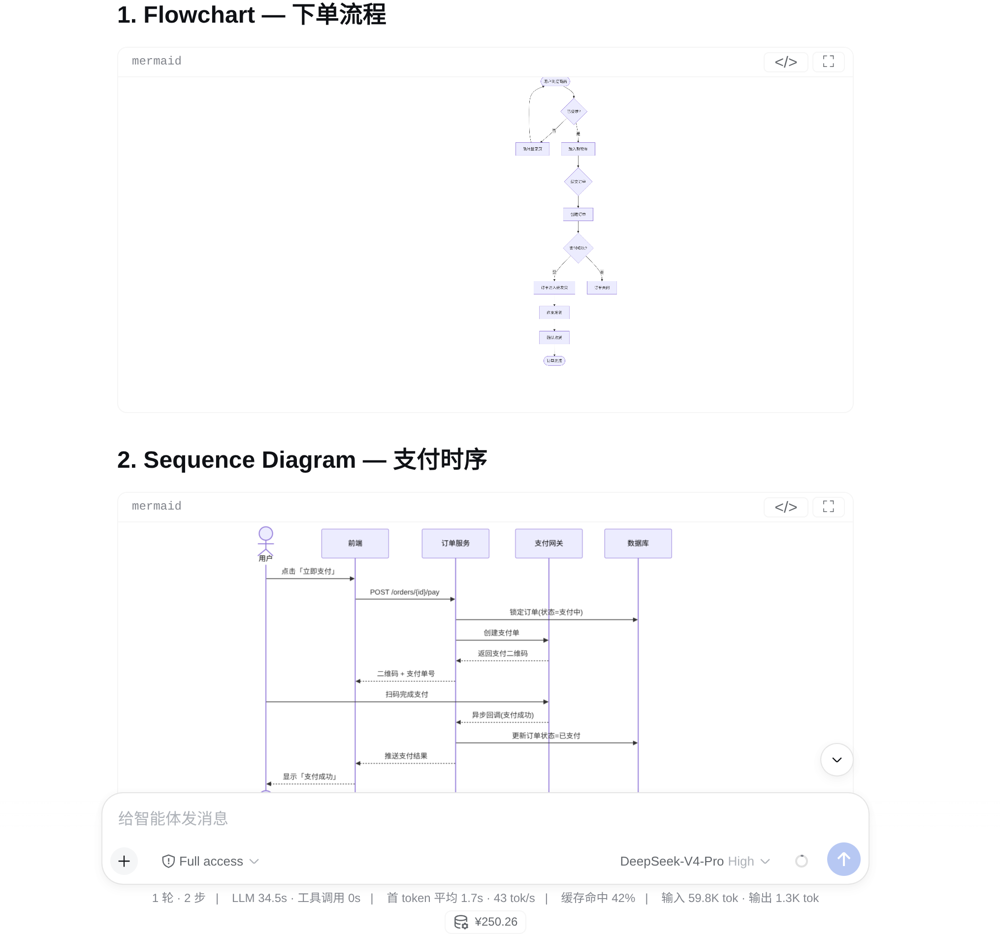
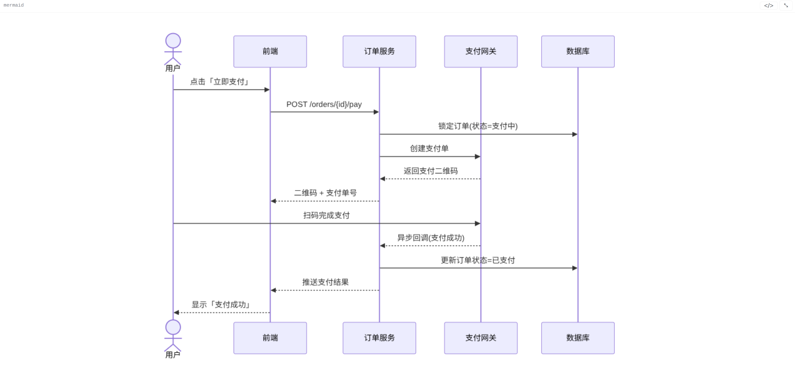
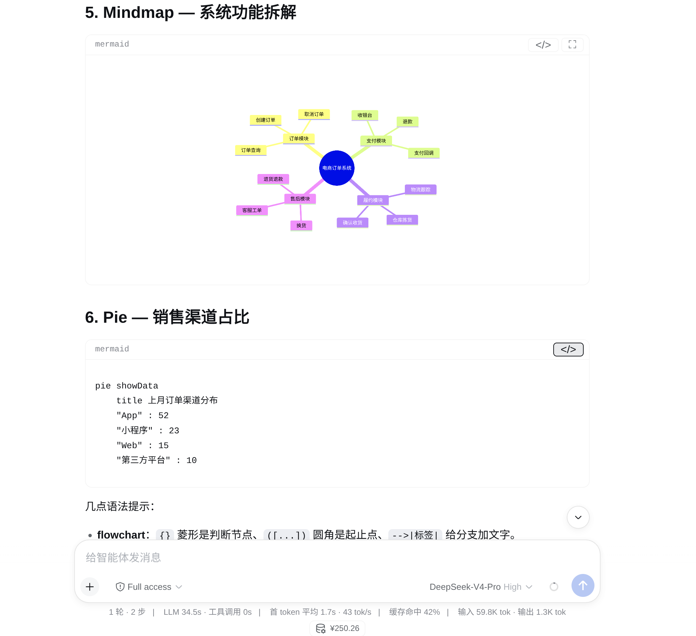

# dsh-mermaid-smooth

English | [中文](README.zh.md)

Render mermaid code fences in DeepSeek Harness (dsh) web chat as diagrams by
default, with smooth zoom and pan, a per-fence diagram/code toggle at each
card's top-right, a persisted per-fence preference, dark-mode follow, and a
fully bundled offline engine (zero CDN).

- **Default diagram** — fences in assistant messages render as SVG diagrams
  the moment they are complete; non-mermaid code blocks are untouched.
- **Smooth interaction** — cursor-anchored wheel zoom over one composed
  transform (with a short ease-out), direct pointer drag, double-click to
  fit. Reduced-motion preferences disable all easing.
- **Toggle at top-right** — every diagram card has a 图/文案 (diagram/code)
  switch; several fences in one message toggle independently.
- **Per-fence memory** — the toggle state persists in localStorage keyed by
  the fence source, so it survives page reloads and reconnects.
- **Dark-mode follow** — diagrams re-render with the GUI theme.
- **Safe and offline** — mermaid runs at securityLevel 'strict' (built-in
  sanitization, no click handlers), the engine is bundled into the plugin
  (zero CDN), and a failed fence keeps its original code with an inline
  error banner. Uninstalling restores the conversation verbatim.

## Screenshots







## Install

```sh
dsh plugin --profile web add dsh-mermaid-smooth
```

For a local checkout, point the add command at the directory:

```sh
dsh plugin --profile web add /path/to/dsh-mermaid-smooth
```

Restart the web app (`dsh web`, or your `dsh-web` service) so the new bundle
layer is composed.

## License

MIT
