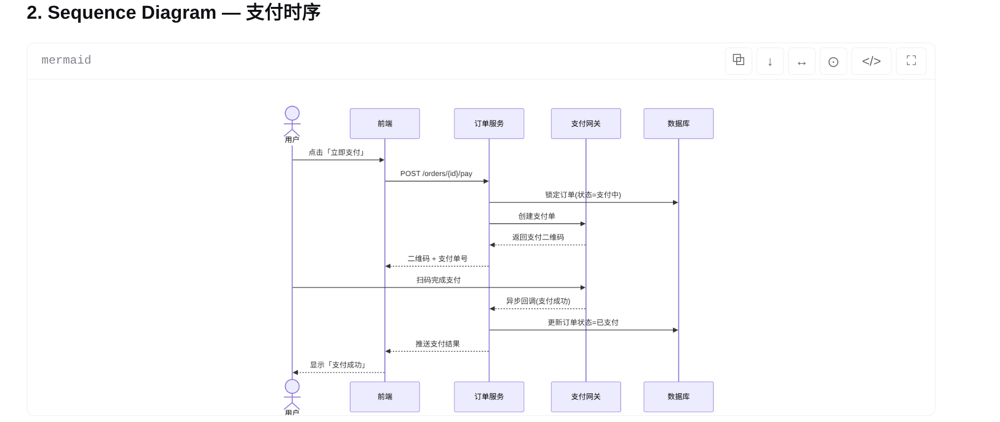
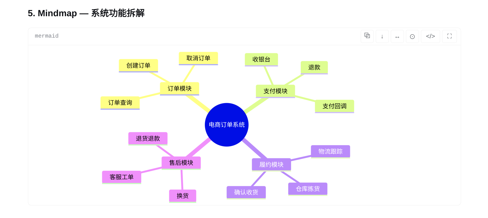
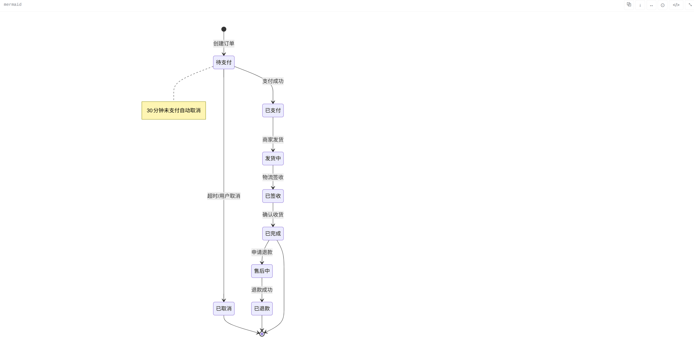

# dsh-mermaid-smooth

[English](README.md) | 中文

将 DeepSeek Harness（dsh）Web 对话中的 mermaid 代码围栏**默认渲染为图**：丝滑的缩放与拖拽，每张图右上角提供图/文案切换，偏好按围栏记忆，明暗主题跟随，渲染引擎完全本地打包（零 CDN）。

## 支持的图表类型

插件本地打包了 **Mermaid 11.17.2**，无需再接入其他图表库，即可渲染以下图表：

| 类型 | 语法 |
| --- | --- |
| 流程图 | `flowchart` / `graph` |
| 时序图 | `sequenceDiagram` |
| 状态图 | `stateDiagram` |
| 类图 | `classDiagram` |
| 思维导图 | `mindmap` |
| 甘特图 / 时间线 | `gantt` / `timeline` |
| ER 图 | `erDiagram` |
| 用户旅程、饼图、Git 图、桑基图、XY 图、看板、架构图等 | 由内置 Mermaid 引擎支持 |

- **默认成图** — 助手消息中的 mermaid 围栏一旦完整立即渲染为 SVG 图；非 mermaid 代码块不受影响。
- **丝滑交互** — 滚轮缩放以指针为锚点（单一 transform 合成 + 短过渡），拖拽平移 1:1 跟手，双击适应/复位；系统开启「减少动态效果」时全部动画禁用。
- **实用工具** — 可一键适应宽度或全图、复制 Mermaid 源码、下载渲染后的 SVG；全屏时按 <kbd>Esc</kbd> 即可退出。
- **右上角切换** — 每张图卡片有「图/文案」切换按钮；一条消息中的多个围栏各自独立。
- **按围栏记忆** — 切换状态存于 localStorage（以围栏源码为键），刷新页面、重连后保持。
- **主题跟随** — 图随 GUI 明暗主题重新渲染。
- **安全离线** — mermaid 以 securityLevel 'strict' 运行（内置消毒、不绑点击事件），引擎打包进插件本体（零 CDN）；渲染失败的围栏保留原代码并内联错误条。卸载插件后对话原样还原。

## 图表卡片工具栏

每张图卡片右上角有一排图标按钮，悬停可见文字提示：

| 图标 | 功能 | 说明 |
| --- | --- | --- |
| ↔ | 适应宽度 | 将图缩放到卡片宽度（也是初始状态） |
| ⊙ | 适应全图 | 缩放到整张图完整显示在视口内 |
| ⧉ | 复制源码 | 把当前围栏的 Mermaid 源码复制到剪贴板。优先使用异步 Clipboard API，不可用时降级为隐藏 textarea 方案；成功显示「已复制源码」，失败显示「无法复制源码」。 |
| ↓ | 下载 SVG | 把渲染好的图保存为 `mermaid-diagram.svg` —— 矢量文件，在浏览器、文档、设计工具里任意缩放都不失真。图尚未渲染完成时会显示「图表尚未渲染完成」。 |
| `</>` | 图 / 文案 | 在图与源码之间切换；按围栏记忆偏好 |
| ⛶ | 全屏 | 全屏查看图（仅图视图）。<kbd>Esc</kbd> 退出，焦点回到全屏按钮。 |

工具栏的状态提示约两秒后自动消失，并通过 `aria-live="polite"` 播报给屏幕阅读器。

## 截图







## 安装

dsh-mermaid-smooth 是 DeepSeek Harness (dsh) Web 界面的插件。使用前请确保你已安装并配置好 dsh 命令行工具及 Web 环境。

四种方式任选其一，装完重启 DSH Web 即生效（当前会话会中断，但 DSH 会话有磁盘持久化，重启后可以恢复）。

**方式一：npm 正式包（推荐，最简单）**

```sh
dsh plugin --profile web add dsh-mermaid-smooth
```

安装时无需编译。pnpm 可能会自动把该包加进 profile 的 `pnpm-workspace.yaml` 的 `minimumReleaseAgeExclude`（因为包刚发布）——这是预期行为，无副作用。

**方式二：从 GitHub 安装（固定到指定提交）**

```sh
dsh plugin --profile web add 'github:gitByteFree/dsh-mermaid-smooth#<40位commit>'
```

固定到你想装的 commit（如仓库提交历史页显示的 main HEAD），之后 main 的新改动不会静默改变已安装代码。源码安装时会在本机构建（`prepare` 脚本执行 esbuild 打包），需要 git 与 Node.js ≥ 20。

**方式三：从 Release tarball 安装（离线 / 不便走 git 的环境）**

从本仓库 [Releases](https://github.com/gitByteFree/dsh-mermaid-smooth/releases) 下载 `dsh-mermaid-smooth-<版本>.tgz`（内含构建好的 `lib/client.js`，安装时无需执行任何 prepare 脚本），然后：

```sh
dsh plugin --profile web add ./dsh-mermaid-smooth-<版本>.tgz
```

**方式四：克隆后从本地路径安装（开发迭代）**

```sh
git clone git@github.com:gitByteFree/dsh-mermaid-smooth.git
cd dsh-mermaid-smooth
dsh plugin --profile web add .
```

安装后重启 web 应用（`dsh web` 或你的 `dsh-web` 服务），使新 bundle 层生效。

## 许可

MIT
